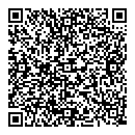
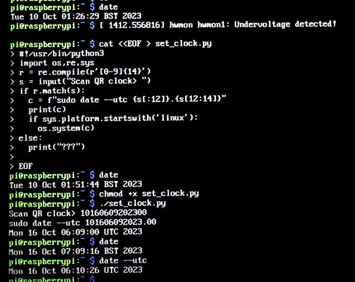

# Airgapped Clock Stuff

The tools in this directory are meant to assist with setting accurate time on
an airgapped Linux workstation (likely a Raspberry Pi).

Contents:
- index.html: Static web page that displays QR code clock with UTC timestamps
- set_clock.py: Script to assist with setting time on airgapped Linux box

Intended Use:

1. Open [index.html](index.html) in a web browser on a computer that has
   NTP-synced time

2. Prepare a Raspberry Pi SD card image, perhaps with `bootfs/config.txt`
   edited to include:
   ```
   dtoverlay=disable-wifi
   dtoverlay=disable-bt
   ```

3. Boot the Pi and connect a USB HID 2d barcode scanner

4. Optionally, use `raspi-config` to configure the timezone and locale.

5. Use a text editor to type `set_clock.py` into the airgapped Pi, or scan
   `set_clock_qr_code.png` which contains the text of `set_clock.py`. Make the
   script executable with `chmod +x set_clock.py`. This is the QR code with the
   text of the script:
   

7. Check the current system time with `date`

8. Run `set_clock.py` on the airgapped Pi (this will run `sudo date --utc ...`)

9. Scan a timestamp QR code from the clock (barcode scanner must be configured
   to send an Enter key press). This will cause `set_clock.py` to set the Pi's
   clock to the UTC timestamp contained in the QR code.

On the Pi, the process might look about like this:




## Notes on set_clock.py

set_clock.py is meant to be run on an airgapped Linux system, such as a
Raspberry Pi, to set the system time to within +/- 2s of UTC using a 2d barcode
scanner to read an NTP synchronized QR code clock.

Expected QR code timestamp format is MMDDhhmmCCYYss in UTC. This is almost the
format for  setting time with the GNU date command line tool (MMDDhhmmCCYY.ss).
Omitting the "." before seconds makes it easier to encode the full timestamp in
a small QR code.
